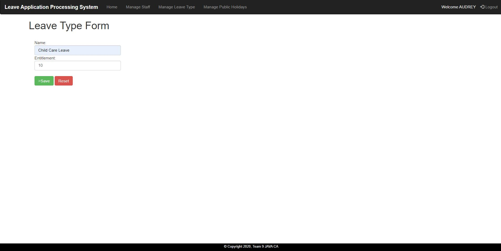
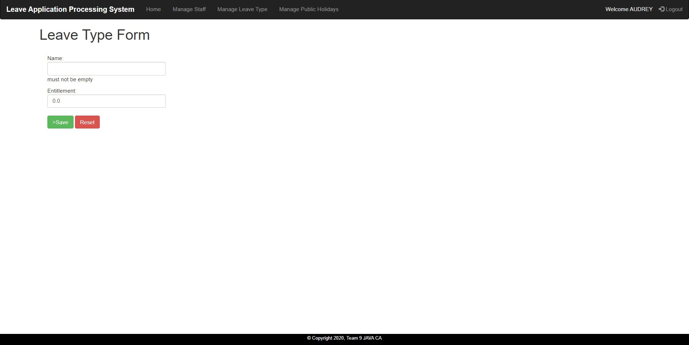
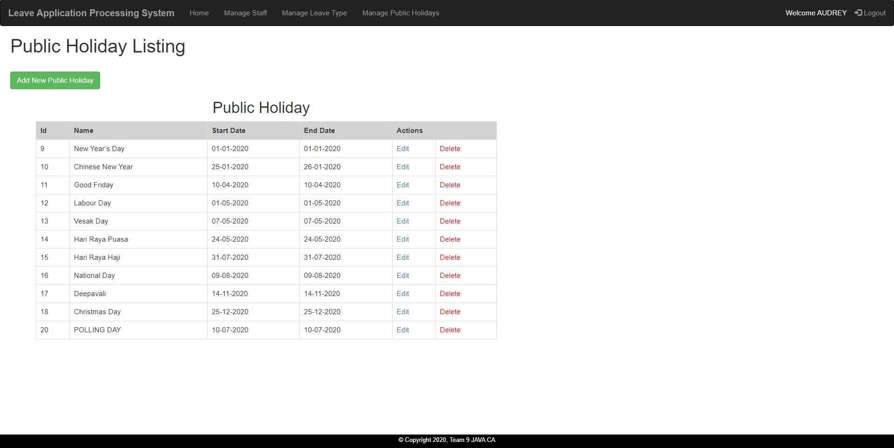

# Leaving-Application-Processing-System
A leave application processing system that accommodates three levels of employee roles and multiple leave categories using Java, Thymeleaf, HTML5, JS, CSS. 
## Admin Login Page

### Invalid Username

### Invalid Password

### Admin Home page

### Staff List

### Add new staff

### Staff Form Validation

### Leave Type List

### Add new leave

### Leave Form Validation

### Holiday List

### Add new holiday

### Holiday Form Validation

